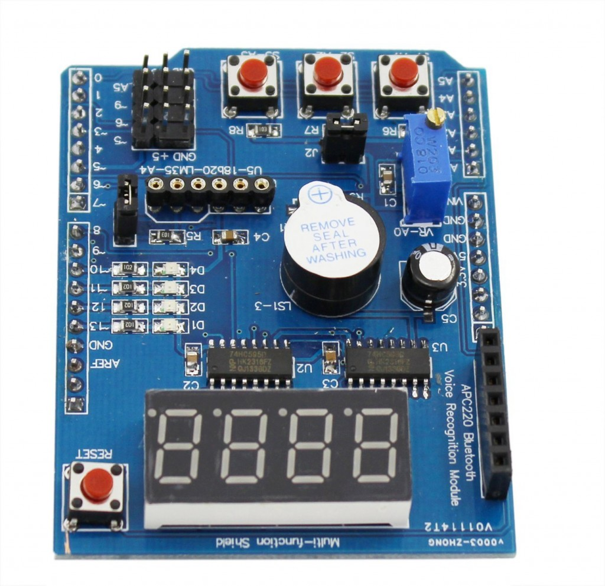

# Arduino Multi-Function shield project

Software project in Visual Studio Code + Platformio-IDE for Arduino Uno with the Multi-Function shield




## Features
- Displays 4 digit values
- Reads IR receiver, temperature, potentiometer, etc.
- Reads from some of the 3 embedded buttons
- Lights on some of the 4 embedded LEDS
- Plays melodies through embedded buzzer

## Code source structure

** Dependencies: ** Needs to have access to RemoteControlledCar_VSCode/lib in this same repository
```
ArduinoMultifunctionShield
|--lib
|  |--MultifunctionShield
|  |  |- CMultifunction.cpp
|  |  |- CMultifunction.h
|--src
|  |- main.cpp
|  |- main.h
|- platformio.ini
RemoteControlledCar_VSCode
|--lib
|  |--RCCLib_Melodies
```